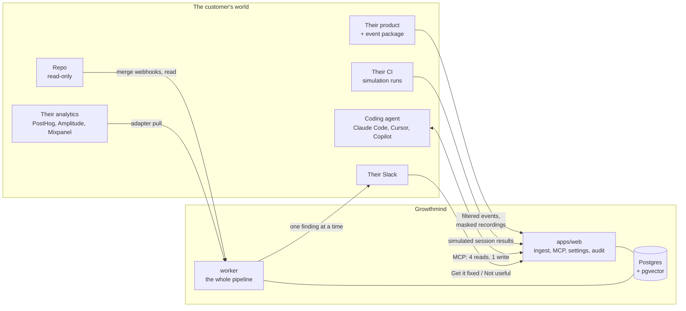
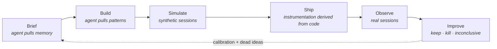
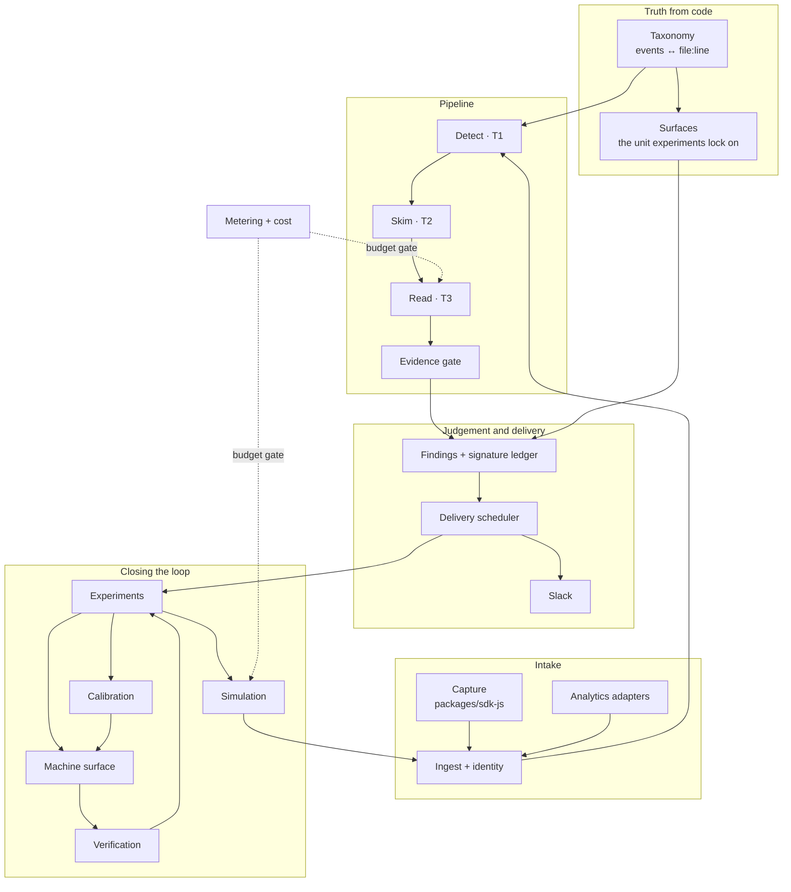
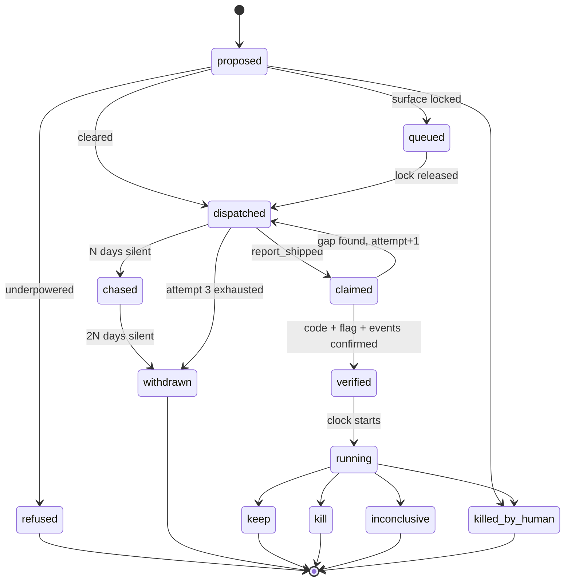
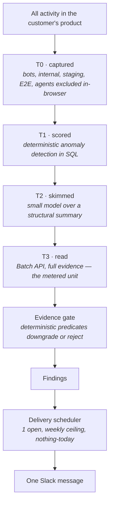
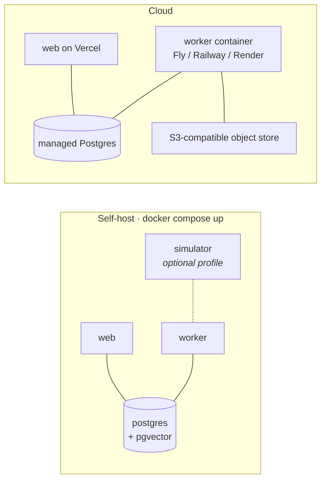

# Growthmind: Architecture

> How the product on [growthmind.ai](https://growthmind.ai) is put together, and why each
> structural decision is the one that satisfies
> [`product-decisions.md`](product-decisions.md) rather than merely working.
>
> [`product-decisions.md`](product-decisions.md) says **what** must be true (§1–§12).
> [`stack.md`](stack.md) says **what we build on**.
> This document says **what the pieces are, where each commitment is enforced, and which
> tensions between commitments were resolved which way**. A change here is an
> architecture decision, not a docs edit — and a design that violates a product
> decision is declined regardless of elegance.

---

## Contents

1. [The shape of the thing](#1-the-shape-of-the-thing)
2. [Load-bearing decisions](#2-load-bearing-decisions)
3. [Tensions, and how they are resolved](#3-tensions-and-how-they-are-resolved)
4. [Subsystems](#4-subsystems)
5. [The cost funnel](#5-the-cost-funnel)
6. [Data model](#6-data-model)
7. [Machine surfaces](#7-machine-surfaces)
8. [Worker task inventory](#8-worker-task-inventory)
9. [Tenancy, privacy, and blast radius](#9-tenancy-privacy-and-blast-radius)
10. [Topology: self-host and cloud](#10-topology-self-host-and-cloud)
11. [Repo layout](#11-repo-layout)
12. [Additions to the stack](#12-additions-to-the-stack)
13. [Build order](#13-build-order)
14. [Traceability: §1–§12 to enforcement point](#14-traceability-1-12-to-enforcement-point)
15. [Open questions](#15-open-questions)

---

## 1. The shape of the thing

Growthmind sits between three things the customer already has — a repo, a coding
agent, and real users — and produces one Slack message at a time.



Everything Growthmind does is one loop, run twice — once against a simulated
audience before launch, once against real behaviour after. **Both halves run through
the same pipeline**; a simulated session is a session with `origin = 'synthetic'`.
That is the single most consequential decision in this document, and §5 explains
what it buys.



**What Growthmind is not.** It is not the customer's event system of record (§11),
it does not write code (§1), and it has no dashboard (§10). Those three absences
shape more of this architecture than any feature does.

---

## 2. Load-bearing decisions

Eight decisions the rest of the system hangs off. Each one is traced to the
commitment that forces it.

### D-1 · The pipeline is a cost funnel, and the billing meter is one of its tier boundaries

§12 forbids running a model over every event and requires cost bounded rather than
linear in session volume. So the pipeline is four tiers, each rejecting the large
majority of what the tier before it passed:

| Tier                         | Where                                        | What it costs        | What survives                          |
| ---------------------------- | -------------------------------------------- | -------------------- | -------------------------------------- |
| **T0 · Excluded at capture** | Browser, in the event package                | Nothing — never sent | Real human sessions only               |
| **T1 · Scored**              | Postgres, deterministic SQL + pure functions | Query time           | Sessions with a structural anomaly     |
| **T2 · Skimmed**             | Small model, structured output               | Cents                | Sessions that look like a real problem |
| **T3 · Read**                | Batch API, full evidence extraction          | The real spend       | Findings                               |

The published meter is "sessions read", which is exactly the T2→T3 boundary. **The
economic boundary and the technical boundary are the same line**, so the thing the
customer is charged for is the thing that actually costs money, and the pre-filter
is not an optimisation that can quietly rot — it is the invoice.

Consequence to accept: T1 and T2 carry the accuracy burden, and a tier that
under-selects loses findings silently rather than loudly. So every exclusion and
threshold in the funnel declares its fail direction in a test: **T0 fails toward
excluding** (a session wrongly dropped is a lost finding; a bot wrongly kept
corrupts a funnel), and **T1 and T2 fail toward including** (a cheap wasted skim is
better than a missed problem).

### D-2 · The finding primitive is a signature, not a sentence

§6: _"Every finding must carry a stable, deterministic ID... English is the
rendering, never the primitive."_ So a finding is a hash of a structured tuple:

```
signature = sha256(project_id, surface_id, symptom_class, evidence_shape)
```

The English is generated from the signature's evidence, never the other way around.

A hash is only as deterministic as its inputs, and two of these are derived.
`surface_id` must survive re-derivation: surfaces are re-derived from code on every
merge (§4.4), so a matched surface **inherits its existing id** through ancestry
tracking, and a removed surface is tombstoned, never reused. `evidence_shape` is a
versioned canonical serialisation — a pure function with fixture tests — never a
raw payload. Without both, an ordinary refactor forks the signature: the same
problem comes back as new, dismissals stop suppressing, dead ideas get re-proposed.
Every guarantee in this section is only as strong as this identity.

One table — the **signature ledger** — holds the lifetime state of every signature
ever seen: first seen, times seen, delivered at, dismissed at, experiments run,
verdicts reached, human overrides.

Every stage consults it before doing anything expensive:

- Findings: already delivered? Don't surface it again (§7).
- Findings: dismissed? Suppressed permanently, and the dismissal is a ranking
  signal (§7).
- Experiments: already tried and killed? Never propose it again (§8).
- Brief interrogation: this surface has history — hand it to the agent (§8).

This ledger is the memory §8 says a stateless prompted agent cannot have. It is one
table, and it is the product's moat expressed as a primary key.

### D-3 · The model proposes; deterministic evidence predicates dispose

§6 forbids asserting causation that cannot be proved — _"'Save failed' needs the
absent network call, not an inference from repeated clicks."_ A model asked for a
verdict will produce a confident one every time. So model output is **external
data**: parsed with Zod, then passed through an **evidence gate** — a pure function
per finding class that can downgrade or reject the model's claim.

| Class             | Owner                | Proof the gate requires                                              | If proof is absent          |
| ----------------- | -------------------- | -------------------------------------------------------------------- | --------------------------- |
| `broken`          | Engineering          | A failed or absent request correlated to the action                  | Downgrade to `confusing`    |
| `confusing`       | Design / product     | Hesitation, backtracking, or repeated attempts at one decision point | Downgrade to `changed_mind` |
| `changed_mind`    | Growth / positioning | Clean exit, no error, no struggle signal                             | Drop                        |
| `instrumentation` | Engineering          | A known event's firing rate crossing its own threshold               | Drop                        |

The gate always fails toward the _weaker_ claim, never the stronger one. This is
also where §6's three-way split — bug vs design problem vs changed their mind — is
mechanically enforced rather than left to a prompt.

### D-4 · Backpressure is a scheduler, not a filter

§7 requires one finding at a time, a hard weekly ceiling, and a real "nothing worth
telling you today" state. Scattering that across the delivery code guarantees
someone eventually posts a second message. So there is a distinct component between
Findings and Delivery — the **delivery scheduler** — holding a token bucket and an
"open finding" lock. It has three outputs and only three: deliver one, defer, or
post the honest nothing-today state. Nothing else can post to Slack.

Two decisions stated rather than assumed. **Scope: scheduler state is per project**
— findings, channels and connections are project-scoped, and one project's open
finding must not silence a sibling project; whether §7's weekly ceiling should
_also_ cap org-wide is a product call ([§15](#15-open-questions)). **The lock gets
the same zero-orphans treatment as experiments**: it carries a TTL and a daily
reconciler (`deliver.reconcile`), because a lock stuck behind a permanently failed
delivery or an ignored finding reads as an eternal — and dishonest — nothing-today.

### D-5 · Growthmind supplies memory and criteria; the customer's agent supplies reasoning and typing

The site's first three steps — Brief, Build, Simulate — all happen inside the
customer's coding agent. Growthmind does not run a second agent alongside it. It
exposes what it knows (prior findings, dead ideas, calibration for this surface,
proven patterns) and the criteria a change must meet, and the agent does the
thinking.

This is not modesty, it is three commitments at once: §1 (read-only repo access
suffices), §12 (token cost falls on their budget, so it must be _their_ agent
spending it), and §10 (one output, two audiences — the fix spec is legible to a
founder and executable by an agent because it is the same artefact).

### D-6 · The app is the record; Slack is the interface

§10 says non-dashboard. §5 says nothing may happen the customer cannot inspect
afterwards. Those are reconcilable only if the web app exists but is not where the
work happens: it holds install, connections, billing, the append-only audit log,
export, and the kill switch. Findings are **pushed**, never pulled. If a user has to
open the app to learn something, that is a design bug.

Test that holds the line: the Slack renderer is a pure function with a legibility
budget asserted in unit tests — no message may require a link to be understood, and
every count carries its denominator.

### D-7 · Everything Growthmind stores is derived, retained on a window, and exportable

§11 forbids becoming the event source of truth. The event store is a **derived read
model** with a retention window, not an archive. Two properties prove compliance
rather than assert it:

1. The whole product runs with the event package uninstalled, off a third-party
   adapter alone.
2. `GET /api/export` returns every finding, experiment, verdict and learning as
   JSON. There is no state that only Growthmind can read.

### D-8 · Source code is processed, never stored

Repo access is read-only, and the only durable artefacts derived from it are the
event taxonomy (name, file, line, commit SHA, English description) and surface
definitions. Source text is held in memory for the length of a derivation and
discarded. The fix spec rule — _never include code_ — is what makes this possible:
nothing downstream ever needs a snippet, so nothing upstream needs to keep one.

---

## 3. Tensions, and how they are resolved

These are the places where two commitments pull against each other. Each is a
decision, and each is written down so it is not silently re-decided.

### T-1 · §1's 24-hour first finding vs §12's batch economics

The Batch API is what makes deep reads affordable, and it has a turnaround of up to
24 hours. Building the first-finding path on it spends the entire promise on
queueing.

**Resolution: two lanes.** A **cold-start lane** runs synchronous inference over a
hard-capped sample during a project's first 48 hours; the **steady-state lane** uses
Batch thereafter. Same code path, different submitter, selected by project age and
a per-project cap. The cold-start lane's cost ceiling is fixed and small, so §12
still holds.

### T-2 · §1's 24-hour first finding vs a product with no users yet

The customers this is built for often have close to no traffic on install. A
pipeline that needs real sessions cannot hold a 24-hour promise for them.

**Resolution: simulation is the cold-start.** At install, before any real traffic,
Growthmind specs a simulated cohort against the customer's ICP and their existing
build; the run produces synthetic sessions that flow through the identical pipeline
and yield a real finding on day zero. This is why the site's pre-launch loop and
§1's promise are the same mechanism rather than two features.

### T-3 · §3's "alert when an event stops firing" vs §7's hard finding ceiling

Silent instrumentation death poisons every number built on it. Suppressing that
alert under a weekly finding budget means the customer's ceiling is spent on
findings the broken instrumentation already invalidated.

**Resolution: integrity alerts are not findings.** The `instrumentation` class
travels a separate lane with its own budget, deduplicated per event per incident
(one alert per broken event, not one per day). It does not consume the §7 ceiling
because it is not a growth claim — it is a statement that the growth claims cannot
currently be trusted.

### T-4 · §5's "prove there is no PII" vs §6's "attach the evidence"

Masking cannot be perfect, and the recording is the evidence. This is open question
#2 in the machine-surfaces draft.

**Resolution: withhold the clip, keep the finding, say so.** Masking is
allowlist-first at capture (text is masked unless a selector is explicitly allowed),
and each recording carries a mask confidence report. Below threshold, the clip is
not attached; the finding ships with its structural evidence — the event sequence,
the failed request, the counts with denominators — and the message states plainly
that the recording was withheld. A finding without a clip is degraded; a leaked name
is an incident. The fail direction is not symmetric, so neither is the design.

> This resolves a question owned outside this document. It needs ratification before
> the machine-surfaces draft graduates to `docs/`.

### T-5 · §1's "must not assume a feature flag system" vs §9's "verify it is live for real users"

Half the target segment has no flag system, and §9 requires observing a traffic
split before the clock starts.

**Resolution: a flagless lane with a stated rollback.** Where no `FlagSource`
adapter is configured, the experiment ships as a before/after with (a) a named
rollback commit recorded in the fix spec, (b) a stated confound risk in the verdict,
and (c) a wider required effect size from the power calculation to compensate. The
verdict says which lane it ran in. An experiment that cannot reach significance in
the flagless lane is **refused up front** (§8) rather than run and reported weakly.

### T-6 · §11's "never the source of truth" vs owning a Postgres pipeline

Resolved by D-7: derived read model, retention window, adapter-first, export
endpoint. The distinguishing test is not where the bytes live, it is whether the
customer can leave without losing anything they cannot regenerate.

### T-7 · The one-command self-host promise vs simulation and clip rendering needing a browser

A Playwright image is a large dependency, and the stack plan rejects anything that
makes a stranger provision a server before seeing the product work.

**Resolution: the driver is a port, and the browser is an optional compose profile.**
The default `SimulationDriver` writes the run as Playwright code **into the
customer's repo via their coding agent** and consumes results from their CI — no
browser in Growthmind's stack at all. `docker compose --profile simulator up` adds a
hosted driver for people who want it. Clip rendering degrades the same way: without
the profile, findings carry a still frame and a text timeline instead of an animated
preview. Core `docker compose up` stays three services.

### T-8 · The site's six-step loop vs §1–§12's post-launch scope

Worth stating plainly: [`product-decisions.md`](product-decisions.md) governs the
post-launch loop end to end and never mentions simulation, brief interrogation, or
prediction-vs-actual calibration — all three of which the site sells as the
differentiator. This architecture covers them, but they are currently specified by
marketing copy rather than by a commitment.

**Resolution: architecture proceeds; the decisions doc needs a §13.** The
simulation half is designed here to reuse the post-launch machinery precisely so
that adding it costs one new subsystem rather than a second product. The commitments
it should be held to — how a simulated finding is labelled, whether a simulated
finding may open an experiment, what calibration is allowed to claim — are product
decisions, not architecture, and are listed in [§15](#15-open-questions).

---

## 4. Subsystems

Twelve. Each has one responsibility, an owning package, and a named self-host story.



### 4.1 Capture — `packages/sdk-js`

One package, one line to install. It does more work than a typical SDK because §4
and §5 are far cheaper to satisfy in the browser than in a pipeline.

- **Exclusions before send.** Internal domains (inferred from the org creator's
  email domain), bots, crawlers, uptime monitors, E2E runs, load tests, staging and
  preview environments, and the customer's own coding agent browsing the app. An
  excluded event is never transmitted, so §4's "never sent" is literal. Domain
  inference carries a free-mail deny list — a founder signing up from gmail.com
  must never mark every Gmail user internal — and an inferred domain is shown to
  the customer before it takes effect, because its backfill (§4.2) retroactively
  rewrites history.
- **Masking at capture.** Recordings are masked DOM reconstructions built on rrweb,
  configured **allowlist-first**: text is masked unless a selector is explicitly
  allowed. A masking rule that misses fails toward masking.
- **A capture-side pre-filter.** Sessions with no anomaly signal never leave the
  browser as recordings — only as event counts.

Design constraint: it must be small, fast and boring. If the package is heavy it
becomes the reason for uninstall and nothing else in the product gets a chance.

### 4.2 Ingest and identity — `apps/web/app/api/ingest`

Accepts batches, validates with Zod, assembles sessions, and stitches identity
across anonymous → signed-up → account. §4 requires flagging broken stitching rather
than reporting nonsense, so stitching health (unlinked-anonymous ratio, link-rate
step changes, implausible per-identity session counts) is monitored and emits an
`instrumentation` finding when it degrades.

Writes are attributed by credential, never by payload. Each project issues
**public write keys**; the server derives `project_id` and `origin` from the key —
a standard write key can only ever produce `origin = 'real'`, a simulation-scoped
key (§4.11) can only ever produce `'synthetic'`, and no payload field can say
otherwise. A public key is spoofable by construction — the same accepted risk as
every analytics SDK — so the containment is structural: a key reaches exactly one
project, is rate-limited and rotatable, and anomalous key traffic quarantines
rather than ingests.

Exclusion is retroactive: when a new internal domain is inferred, `exclusions.backfill`
re-marks historical sessions and recomputes any funnel that used them. The backfill
is idempotent and re-runnable from scratch — marking is a deterministic function of
the current domain set, so a crash mid-run costs a re-run, not a half-marked
history.

### 4.3 Analytics adapters — `packages/adapters`

A `SessionSource` port with four implementations: first-party SDK, PostHog,
Amplitude, Mixpanel. §11's open question — _"an adapter pattern so a first-party
source can be added later"_ — is answered by inverting it: **the adapter boundary
exists from the first commit and the first-party SDK is simply the first adapter.**
Retrofitting a port after a pipeline has grown into a single source is the expensive
version of this decision.

A project runs **one active `SessionSource` at a time**, enforced at configuration.
Two live sources ingest the same humans twice and double-count every funnel, and
cross-source session dedup is a research project rather than a feature — so
switching sources is a cutover with a timestamp, and simultaneity is rejected
rather than reconciled.

Sibling ports, same package: `FlagSource` (none · PostHog · LaunchDarkly · custom
endpoint), `ObjectStore` (Postgres · S3-compatible), `ChatSurface` (Slack first).

### 4.4 Taxonomy and surfaces — `worker/tasks/taxonomy`

The bridge between code and meaning, and the subsystem that makes §2 and §3 true by
construction:

- Derives events from the repo, each tied to a file and line and a commit SHA.
- Re-derives on **every merge to main**, driven by a repo webhook. Staleness is
  therefore impossible rather than disciplined. Duplicate webhooks are handled by
  idempotency on commit SHA; _ordering_ is handled by an ancestry guard — a webhook
  arriving late for an older commit never becomes the current snapshot.
- Diffs the taxonomy per release and reports what shipped untracked.
- Detects when a known event stops firing and raises an `instrumentation` finding.
- Derives **surfaces** — the screen or flow node that experiments lock on and that
  findings are addressed to. Surface identity is stable across re-derivations: a
  re-derived surface that matches an existing one (rename-tracked path plus
  structural fingerprint) inherits its id, the old→new mapping is recorded on the
  taxonomy diff, and D-2's signatures survive refactors because of it.

Implemented behind a `CodeAnalyzer` port; the first implementation is TypeScript via
`ts-morph`, with tree-sitter as the extension point for other languages. No event
registration API exists anywhere in the product — that would create a second source
of truth and bring §3's drift problem straight back.

### 4.5 Detect · T1 — `packages/core/detect`

Deterministic, model-free, and the cheapest tier that can be wrong. Pure functions
over session structure: funnel drop-off, dead clicks, rage clicks, request failures,
form abandonment, time-to-first-value regression, thrash. Scores are computed in SQL
and pure TypeScript, unit-tested against fixtures, and every threshold declares its
fail direction in a comment and a test.

This tier also proposes the **activation definition** from observed behaviour, which
the customer corrects rather than authors (§1).

### 4.6 Skim · T2 and Read · T3 — `worker/tasks/analyze`

T2 puts a small model over a compact structural summary and returns a typed
verdict — _is there a real problem here, and of what class?_ T3 submits survivors to
the Batch API for full evidence extraction. Correlation is by a batch id **persisted
before submission**, so a poll that returns before the submission row commits still
finds its row. Every exit path records a terminal `completed` or `failed`; a missed
terminal state leaves a customer-visible run stuck forever.

Both tiers' output passes the evidence gate (D-3) before it can become a finding.

### 4.7 Findings and the signature ledger — `packages/core/findings`

Computes the signature, consults the ledger, ranks by **expected value** rather than
frequency (§6), and attaches confidence, sample size, estimated impact, and a
recommended action. Every one of those is a pure, tested function; ranking a rage
click on an unmonetised settings page to the top is a maths bug, not a taste
failure.

The ledger enforces: never surface twice, never resurface a dismissal, remember the
dismissal as a ranking signal, and remember every dead idea forever.

### 4.8 Delivery scheduler and Slack — `worker/tasks/deliver`

D-4. The only component permitted to post. Holds the token bucket, the one-open-
finding lock, and the nothing-today state. Renders through a pure block renderer
with a legibility budget. Slack delivery failure never propagates into the pipeline
— it is retried and surfaced in the app's audit log.

Audience is an explicit field on every delivery, not an accident of whoever
triggered the run: a finding is org-scoped and goes to the configured channel;
teammate visibility is the default and any narrowing is a recorded decision.

The response buttons are a write surface and are treated like one. "Not useful" is
a permanent org-wide suppression, so it requires the Slack responder to map to a
member of the org — the mapping is recorded in the audit log, and an unmapped
responder gets a polite in-thread refusal, never a silent drop or a silent
dismissal. Both actions are idempotent on `(finding_id, action)`: Slack retries
its interaction webhooks and humans double-click, and neither may yield two
dispatches or two dismissal records.

### 4.9 Experiments — `packages/core/experiments` + `worker/tasks/experiments`

The subsystem §8 and §9 are almost entirely about. It is a state machine with a
reconciler, because "zero orphans, ever" is a scheduling property, not a discipline.



Enforcement points:

- **Power check before dispatch.** A pure function over the surface's observed
  traffic. Underpowered means `refused`, with the reason said out loud. §8 calls this
  blocker #1 and the refusal is the feature.
- **Surface lock.** One experiment per surface and per overlapping funnel step, held
  in a lock table. Acquisition is a unique-index-backed insert — two concurrent
  proposals cannot both take a surface, because the race is settled by the
  constraint, not by a check that ran earlier. The MCP layer returns the
  locked-surface error naming the other experiment and its readout date, so an
  agent cannot cheerfully create the collision.
- **Concurrency cap** per org, enforced at proposal time by an atomic conditional
  increment — read-then-write would let two simultaneous proposals both pass a cap
  with one slot left.
- **Immutable readout date**, stated inside the artefact the agent reads.
- **Three attempts, then withdraw** — re-dispatch narrows to the gap and never
  repeats the whole spec.
- **Force-close reconciler**, a daily cron: any experiment past readout without a
  terminal state is closed. Graphile Worker's cron-with-backfill is why a missed
  03:00 run does not become a permanent hole.
- **Human kill at any moment**, with the reason recorded and fed back into ranking.

### 4.10 Verification — `worker/tasks/verify`

§9: the agent's "done" is a claim. `report_shipped` returns
`{ received: true, verified: false }` and nothing an agent says can flip that field.
Verification is independent and three-part: **code present** (repo read at the
claimed commit), **flag live** (`FlagSource`, or the flagless lane's rollback
commit), **events firing** (the event stream, plus an observed traffic split where
flags exist). Only all three start the clock.

### 4.11 Simulation — `worker/tasks/simulate` + `packages/skills/growth-simulations`

Growthmind owns the **personas** — an ICP model derived from the repo's own copy and
docs, the customer's stated ICP, and observed behaviour once it exists. The customer
owns the **driver**: the simulation is written as code in their repo by their agent,
reviewed like anything else they ship, and run in their CI against their preview
deployment. Results post back through the same ingest endpoint using a
**simulation-scoped write key**, and the server stamps `origin = 'synthetic'` from
the credential (§4.2) — never from a payload field. The driver is code Growthmind
does not control; a tag it was merely trusted to set would eventually be omitted,
and synthetic sessions would pollute real funnels as false findings. The stamp
lives where the trust lives.

Three things fall out of that for free: no browser in the default stack (T-7),
synthetic traffic already excluded from real funnels by the same field that handles
E2E runs (§4), and simulated sessions analysed by the same tiers, gates and
renderers as real ones.

### 4.12 Calibration — `packages/core/calibration`

Records predicted stall vs observed stall per surface and signature, and stores the
delta. This is the compounding asset the site claims, so it has a precise
definition: **a calibration record is only written when the same signature was
predicted pre-launch and measured post-launch on the same surface.** Anything looser
is a vanity number. Calibration is retrieved (pgvector) as context for future
briefs, which is how "your next brief starts smarter than your last" is actually
implemented.

### 4.13 Metering and cost — `packages/core/meter`

§12 requires cost visible **before** a run. Every T3 submission and every simulated
run produces a `CostEstimate` first — candidates × tokens per session × price —
recorded and surfaceable. Per-org monthly ceilings are enforced by a **sampler that
degrades the read rate as budget depletes**, not by a hard stop and not by silent
overage: the customer is told, work continues on a smaller sample, and the next plan
is offered. That behaviour is a published promise, so it is a scheduler input rather
than a billing afterthought.

---

## 5. The cost funnel

The spine of D-1, with the numbers that make the economics work. Illustrative ratios
— the _shape_ is the commitment, the constants get tuned against real data.



Two properties this buys:

- **Cost is bounded by the funnel's narrowest tier, not by traffic.** A customer
  whose volume grows tenfold does not cost ten times more, because T1's ceiling is
  a rate, not a ratio.
- **The customer's invoice is legible.** "Sessions read" is a row count they can
  reconcile, and every read is listed in the audit log.

---

## 6. Data model

Drizzle schema in `packages/db`. Grouped by subsystem; every table is
organisation-scoped and, where telemetry-bearing, project-scoped.

**Identity and tenancy** — `organizations`, `users`, `members`, `projects`,
`project_repos`, `project_connections`, `api_keys`, `write_keys` (per-project
ingest credentials, `kind: standard | simulation` — the server derives
`project_id` and `origin` from the key, §4.2).

**Intake** — `identities`, `identity_links`, `sessions`
(`project_id, identity_id, started_at, origin: real|synthetic, exclusion_reason,
tier_reached, cost_cents`), `events` (partitioned monthly), `recordings`
(`blob_ref, mask_report, mask_confidence`), `network_log`.

**Truth from code** — `event_defs` (`name, file, line, commit_sha, description,
first_seen, last_seen, firing`), `taxonomy_snapshots`, `taxonomy_diffs`, `surfaces`,
`funnels`, `activation_definitions`.

**Judgement** — `finding_signatures` _(the ledger — see D-2)_, `findings`,
`finding_evidence`, `deliveries` (`channel, audience, slack_ts, response`),
`dismissals`.

**Closing the loop** — `experiments`, `fix_specs`, `surface_locks`, `dispatches`,
`verifications`, `verdicts`, `simulations`, `personas`, `calibration`, `learnings`
(pgvector).

**Platform** — `meter_usage`, `cost_estimates`, `audit_log` (append-only),
`org_kill_switch`.

Three rules the schema is held to:

1. **Stamp/filter symmetry.** Any column a scoped read narrows by must be stamped by
   every write path that reaches that table, or the table is explicitly declared
   exempt with a regression test. A filter on a column nobody writes returns zero
   rows and reads as "no data" rather than as an error.
2. **No id-only mutation paths.** Repositories inject the org filter; a mutation
   keyed on primary key alone does not exist, because that is how an API-key caller
   reaches another tenant's row.
3. **Jsonb columns hold every shape ever written.** DTO boundaries coerce, never
   trust the declared type of persisted data.

---

## 7. Machine surfaces

The machine-surfaces contract governs the shape of these; it is a draft that
graduates into `docs/` when implemented. This section states only how it is served
and the one amendment this architecture requires.

**The fix spec** renders from structured state through a pure function — plain
sentences under fixed headings, every noun resolving to a file the taxonomy already
knows, no code, an immutable date, and the verification criteria stated inside the
artefact because an agent told it will be checked on three things does three things.

**Five tools, four reads and one write** — `list_open_fixes`, `get_fix`,
`get_finding`, `get_events`, `report_shipped` — served from `packages/mcp`, mounted
as a route in `apps/web` for cloud and runnable over stdio for self-host. Every
response carries `fix_id` and `finding_id`; errors instruct rather than merely
report.

**Proposed amendment — a sixth tool, `get_growth_context(surface)`.** The site sells
Brief and Build as the differentiator and neither has a machine surface today. Per
D-5, the fix is not a chat endpoint but a read: return what Growthmind remembers
about this surface — prior findings, dead ideas and why they died, calibration,
known stalls, and the proven patterns for this product type — and let the customer's
agent do the interrogating. It stays read-only, it spends the customer's tokens
rather than ours, and it serves both `growth-context` and `growth-simulations` from
one tool.

> This is an amendment to a settled draft contract, flagged rather than assumed.

**Four open skills** in `packages/skills` — `growth-context`, `growth-events`,
`growth-experiments`, `growth-simulations` — teach the agent to reach for the tools
unprompted and to write instrumentation and simulations as code in the customer's
own repo. Convenience over a contract that has to be right first, so they ship after
the tools do.

---

## 8. Worker task inventory

Graphile Worker. Task names are exported constants, never raw strings — a job queued
under an unregistered name retries forever in silence. A test asserts the registry
contains every constant.

| Task                           | Trigger            | Notes                                              |
| ------------------------------ | ------------------ | -------------------------------------------------- |
| `ingest.assemble-session`      | Queue              | Idempotent on session id                           |
| `exclusions.backfill`          | Domain inferred    | Retroactive by §4                                  |
| `taxonomy.rederive`            | Repo merge webhook | Idempotent on SHA; ancestry-guarded ordering       |
| `taxonomy.diff-release`        | Release webhook    | Reports what shipped untracked                     |
| `taxonomy.detect-silent-death` | Cron, daily        | Raises `instrumentation` findings                  |
| `identity.check-stitching`     | Cron, daily        | Flags rather than reports nonsense                 |
| `detect.score-sessions`        | Cron, frequent     | T1                                                 |
| `analyze.skim`                 | Queue              | T2                                                 |
| `analyze.submit-batch`         | Queue              | Persists batch id **before** submitting            |
| `analyze.poll-batch`           | Cron               | Terminal state on every exit path                  |
| `findings.derive`              | Queue              | Evidence gate runs here                            |
| `deliver.schedule`             | Cron               | The only path to Slack                             |
| `deliver.slack-post`           | Queue              | Failure isolated from the pipeline                 |
| `deliver.reconcile`            | Cron, daily        | Releases stuck open-finding locks (TTL)            |
| `experiments.power-check`      | Queue              | Refusal is a valid outcome                         |
| `experiments.dispatch`         | Queue              | Attempt-aware                                      |
| `experiments.chase`            | Cron, daily        | N days, then 2N                                    |
| `experiments.verify`           | Cron               | Three-part, independent                            |
| `experiments.readout`          | Cron, daily        | Verdict on the immutable date                      |
| `experiments.force-close`      | Cron, daily        | Zero orphans, backfilled if missed                 |
| `simulation.spec`              | Queue              | Produces personas + tasks + criteria               |
| `simulation.ingest-results`    | Queue              | Same path as real sessions; server stamps `origin` |
| `calibration.record`           | Queue              | Only on matched predicted/observed pairs           |
| `meter.rollup`                 | Cron, hourly       | Feeds the degrade-sampling rule                    |

Handlers are plain exported async functions over typed payloads, unit-tested without
touching the queue; registration lives in one queue-aware file.

---

## 9. Tenancy, privacy, and blast radius

**Tenancy.** Authenticated request → tenant context → service → repository injects
the org filter. The risk is never the base methods, it is the paths that step
outside the flow: worker system contexts must be unreachable from user-triggered
paths, hand-written aggregations must carry `organization_id` themselves, and
API-key callers must reach services through a tenant context rather than route auth
alone. Fixtures: two users in one org, one user in a second org, cross-org access
proven impossible by test.

**PII (§5).** Allowlist-first masking at capture; a deterministic residual scanner at
ingest that quarantines rather than drops; a per-project mask report that makes "we
can prove it" a statement about mechanism rather than an audit promise. English
narratives are the hard part — free text captures what a typed field never would.
**Generated finding text does NOT yet pass that residual scanner.** O-011 shipped the
first model-written text and guards it with `guardModelText`, which checks the
assertion contract — that a sentence adds no claim the candidate's own fields do not
carry — and is not a personal-data scan. Running `scanResidualPii` over model text is
what promotes SAC-9 out of `SAC_NOT_YET_ENFORCED`; its heir is named in
`packages/shared/src/summary/assertion-contract.ts`. Until that lands, nothing here or
anywhere else may be read as that scan having happened.

**Forbidden surfaces (§5).** Pricing, billing, auth, consent flows and terms are a
hard deny list checked at proposal time against the surface registry. A growth agent
optimising a consent banner is a legal incident, so the check is structural rather
than a prompt instruction. The classification is itself a keyword-shaped gate and
will therefore miss — so it fails toward denying: a surface is proposable only when
_positively_ classified safe (route patterns, taxonomy signals, and a
customer-confirmable list), and an unclassified surface is refused with the reason
rather than waved through. Near-miss fixtures — a checkout flow named
`upgrade-flow` — are part of this gate's test contract.

**Kill switch (§5).** One action sets `org_kill_switch`, and it is checked at every
egress: ingest accept, worker task entry, Slack post, MCP response. Reversibility is
small by construction because Growthmind never writes code — the only things it
causes in the customer's world are a Slack message, a fix spec, and a flag, and each
has a documented undo.

**Audit (§5).** Append-only, every action, inspectable in the app and exportable.

---

## 10. Topology: self-host and cloud



Identical code, different adapter configuration. The default self-host stack is
three services and needs no account anywhere except a model key. Everything that
would break that promise — the simulation driver, clip rendering, object storage,
billing — is either an optional profile or degrades to a Postgres-backed default.

Cloud runs one piece of real infrastructure beyond the app: a worker container,
because a Postgres-backed queue needs a long-running process.

---

## 11. Repo layout

An extension of the repo layout in [`AGENTS.md`](../AGENTS.md#repo-layout), flagged as a change
because repo layout is a decision:

```
apps/web/            # ingest, MCP route, settings, billing, audit, export
worker/              # Graphile Worker process — every task above
packages/
  sdk-js/            # capture, masking, exclusions, capture-side pre-filter
  db/                # Drizzle schema + migrations
  shared/            # Zod schemas — one source of truth for shapes
  core/              # pure domain logic: detect, findings, experiments,
                     #   power, expected value, evidence gates, renderers
  adapters/          # SessionSource, FlagSource, ObjectStore, ChatSurface
  mcp/               # the tool server — route-mounted and stdio
  skills/            # the four open skills
docs/                # shipped documentation, including this file
```

`packages/core` is the addition that matters. Every pure function this product
depends on — scoring, power, expected value, evidence gates, the Slack renderer —
lives there, consumed by both `apps/web` and `worker`, and tested without booting
either. The repo convention is that pure logic ships with tests; giving it one home
is what makes that enforceable rather than aspirational.

---

## 12. Additions to the stack

Each answers the standing question: _does a stranger still get a working app in one
command?_

| Addition            | Why it is needed                                                                                                                                                      | Licence    | Compose answer                              |
| ------------------- | --------------------------------------------------------------------------------------------------------------------------------------------------------------------- | ---------- | ------------------------------------------- |
| **rrweb**           | Masked DOM recording. Writing our own capture and replay is months, and §5's masking is a solved problem here. `maskTextFn` is the seam we configure allowlist-first. | MIT        | Yes — a browser dependency, no service      |
| **ts-morph**        | Tie every event to a file and line. Regex cannot satisfy §2.                                                                                                          | MIT        | Yes — build-time library                    |
| **web-tree-sitter** | The multi-language extension point behind `CodeAnalyzer`. Not needed for v1.                                                                                          | MIT        | Yes                                         |
| **@slack/web-api**  | The delivery surface.                                                                                                                                                 | MIT        | Yes — the customer's own Slack app          |
| **Playwright**      | Optional simulator profile and clip rendering only. Default driver runs in the customer's CI.                                                                         | Apache-2.0 | Yes — optional profile, degrades gracefully |
| **Stripe**          | Cloud billing only.                                                                                                                                                   | —          | Yes — absent in self-host by design         |

Statistics — power, significance, confidence intervals, expected value — are written
as pure functions in `packages/core` rather than pulled from a library. In a product
whose output is _keep or kill_, the maths is the product and it must be unit-tested
against known cases either way; a dependency adds a licence surface without removing
that obligation.

**Deliberately not added:** object storage. Recordings go to Postgres behind an
`ObjectStore` port, with an S3 adapter for cloud, and split out when volume forces
it — the same reasoning that keeps the event store in Postgres. Worth noting for the
stack doc's licence-trap table: **MinIO's server is AGPLv3**, which makes it a poor
default for a project whose adoption argument is a permissive licence; SeaweedFS
(Apache-2.0) is the escape if a self-hosted object store is ever needed.

Every licence above is verified against the project's own `LICENSE` at the PR that
adds the dependency, not on the strength of this table.

---

## 13. Build order

Milestones on top of the stack plan's Phases 0–5. Each ends in a product-visible
fact, not a layer.

**M1 · Truth from code.** Repo connection, taxonomy derivation on merge, event
package capturing with exclusions and masking, ingest and identity stitching.
_Done when:_ a merge to main updates the event taxonomy without anyone touching a
config file, and an internal-domain event provably never reaches the server.

**M2 · The first finding.** T1 detection, activation proposal, T2/T3 lanes, evidence
gate, signature ledger, delivery scheduler, Slack renderer.
_Done when:_ a fresh install produces one evidenced, dismissible Slack message inside
24 hours, and a second run that same day posts nothing-today rather than padding.

**M3 · The close.** Fix specs, MCP tools, surface locks, power refusal, dispatch,
chase, three-part verification, verdicts, force-close reconciler.
_Done when:_ an experiment dispatched to a real coding agent terminates in keep, kill
or inconclusive on its stated date with no human intervention, and a deliberately
underpowered one is refused with the reason said out loud.

**M4 · Before the launch line.** Personas, simulation specs, the CI driver skill,
synthetic sessions through the same pipeline, calibration.
_Done when:_ a product with zero real users gets a real finding on install day, and
a predicted stall that later occurs writes a calibration record.

**M5 · Alongside, not instead.** Third-party `SessionSource` adapters, the flagless
lane, export, kill switch, cost preflight and degrade-sampling.
_Done when:_ the whole product runs with the event package uninstalled, and the
customer can leave with everything.

---

## 14. Traceability: §1–§12 to enforcement point

Where each commitment is structurally enforced. A commitment with no row here is a
commitment nothing prevents violating.

| §   | Commitment                                         | Enforced at                                                    |
| --- | -------------------------------------------------- | -------------------------------------------------------------- |
| 1   | Install in one action, value fast                  | `packages/sdk-js` one-line install; three-service compose      |
| 1   | Real finding within 24 hours                       | Cold-start lane (T-1) + simulation as cold-start (T-2)         |
| 1   | Activation proposed, not demanded                  | T1 activation proposal, customer corrects                      |
| 1   | No tracking plan up front                          | Taxonomy derived from repo (§4.4)                              |
| 1   | No feature flag system assumed                     | `FlagSource` port + flagless lane (T-5)                        |
| 1   | Read-only repo access suffices                     | D-5, D-8; no write tool exists in the MCP surface              |
| 2   | Events in plain English                            | `event_defs.description`, derived from code                    |
| 2   | Every event ties to a line of code                 | `event_defs.file/line/commit_sha`; no registration API         |
| 2   | Meaning derives from code, not config              | `taxonomy.rederive` on merge                                   |
| 3   | Names never drift                                  | Same; drift is impossible rather than disciplined              |
| 3   | Re-derived on every merge                          | Repo merge webhook → worker task                               |
| 3   | Diff the taxonomy per release                      | `taxonomy.diff-release`                                        |
| 3   | Never a hand-maintained tracking plan              | No registration API, by design                                 |
| 3   | Alert when an event stops firing                   | `taxonomy.detect-silent-death` + integrity lane (T-3)          |
| 4   | Internal events never sent                         | Exclusion before send, in-browser (§4.1)                       |
| 4   | Bots, E2E, staging, agents excluded                | Same, with `origin` covering synthetic traffic                 |
| 4   | Automatic and retroactive                          | Free-mail-guarded inference + idempotent `exclusions.backfill` |
| 4   | Identity stitching, flagged when broken            | `identity.check-stitching` → `instrumentation` finding         |
| 5   | No PII in the stream, provably                     | Allowlist-first masking + residual scanner + mask report       |
| 5   | Never touch pricing, billing, auth, consent, terms | Structural deny list at proposal time (§9)                     |
| 5   | No behaviour change without a flag                 | `FlagSource`, or the flagless lane's stated rollback           |
| 5   | Killable in one action, reversible                 | `org_kill_switch` at every egress; read-only keeps undo small  |
| 5   | Nothing uninspectable                              | Append-only audit log; the app is the record (D-6)             |
| 6   | Confidence and sample size on every finding        | Finding schema; renderer requires denominators                 |
| 6   | Evidence attached                                  | `finding_evidence`; clip degradation stated (T-4)              |
| 6   | Never assert unprovable causation                  | Evidence gate (D-3)                                            |
| 6   | Impact and action always attached                  | Expected-value function; spec renderer                         |
| 6   | Bug vs design vs changed mind                      | Finding classes with per-class proof predicates (D-3)          |
| 6   | Rank by expected value                             | `packages/core/findings`, pure and tested                      |
| 6   | Stable deterministic ID                            | Signature ledger (D-2) + surface-id ancestry (§4.4)            |
| 7   | Backpressure, one at a time                        | Delivery scheduler's open-finding lock (D-4)                   |
| 7   | Hard rate limit                                    | Token bucket per org                                           |
| 7   | Real nothing-today state                           | Scheduler's third output                                       |
| 7   | Dismissals remembered and suppressive              | Ledger `dismissed_at`, permanent by signature                  |
| 7   | Never surface twice                                | Ledger `delivered_at`                                          |
| 8   | Changes go through their agent                     | MCP surface; Growthmind never writes code                      |
| 8   | Kill criterion and readout date set before running | Fix spec fields, immutable date in the artefact                |
| 8   | Refuse underpowered experiments                    | `experiments.power-check` → `refused`                          |
| 8   | No two experiments on one surface                  | `surface_locks` + instructing MCP error                        |
| 8   | Cap concurrent experiments                         | Proposal-time org cap                                          |
| 8   | Never re-propose a dead idea                       | Ledger's experiment history                                    |
| 9   | Verify what shipped vs what was specced            | Independent three-part verification (§4.10)                    |
| 9   | Verify live for real users before the clock        | `verified` → `running` transition only                         |
| 9   | Chase, then escalate or withdraw                   | `experiments.chase`, N then 2N, three attempts                 |
| 9   | Close every experiment                             | Terminal states + `experiments.force-close`                    |
| 9   | Human can kill anything, reason recorded           | `killed_by_human` state, reason feeds ranking                  |
| 10  | Non-dashboard                                      | D-6; findings pushed, never pulled                             |
| 10  | Legible in one Slack message                       | Pure renderer with a tested legibility budget                  |
| 10  | No habit required                                  | Push delivery; nothing to check                                |
| 10  | No babysitting                                     | Worker owns every long-running step                            |
| 10  | One artefact, two audiences                        | The fix spec (§7)                                              |
| 10  | No new vocabulary                                  | Renderer language rules; tools named for what the agent wants  |
| 11  | Never the event source of truth                    | Derived read model + retention window (D-7)                    |
| 11  | Work alongside their analytics                     | `SessionSource` adapters from the first commit                 |
| 11  | Exportable                                         | `GET /api/export`, everything                                  |
| 12  | Cost visible before a run                          | `CostEstimate` before every T3 submission and simulated run    |
| 12  | Bounded, not linear in volume                      | The cost funnel (§5); T1 ceiling is a rate                     |
| 12  | Never a model over every event                     | T0–T2 gate every model call (D-1)                              |

---

## 15. Open questions

**Owned by product — needed before the relevant milestone ships:**

1. **A §13 for the pre-launch half.** Simulation, brief interrogation and calibration
   are sold on the site and unspecified in the decisions doc (T-8). Specifically: how
   is a simulated finding labelled so it is never mistaken for observed behaviour?
   May a simulated finding open an experiment on its own, or only inform a brief?
   What is calibration allowed to claim publicly?
2. **Masking uncertainty.** T-4 proposes withholding the clip and keeping the
   finding. Needs ratification.
3. **`list_open_fixes` and unattended agents.** The machine-surfaces draft asks
   whether a developer running an agent loop overnight gets more than they expected.
   Read-only makes it safe, not necessarily welcome. A per-project "dispatch requires
   a human initial" setting is the obvious lever; whether it defaults on is a product
   call.
4. **Chasing a human about a stopped agent.** Messaging a stopped agent is a message
   into a void, so the chase addresses the human — which brushes §10's no-babysitting
   rule. Still no clean answer.
5. **Is the weekly finding ceiling per project, or also capped per org?** D-4 scopes
   scheduler state per project so sibling projects cannot silence each other, but
   §7 budgets human attention, which is arguably org-level. Per-project is the
   default until ratified.

**Owned by architecture — decided before the code that depends on them:**

6. **Retention window for raw events and recordings.** D-7 requires one; its length
   is a cost and privacy trade-off, and it interacts with retention cohort
   experiments tracked over months.
7. **T1 threshold calibration.** The constants are illustrative until real data
   exists. Each needs a fixture corpus and a stated fail direction before it can
   gate anything.
8. **Multi-language taxonomy.** `CodeAnalyzer` starts TypeScript-only. The trigger
   for the tree-sitter implementation is a customer request, not a milestone.
